<h3><samp>nevern1y@github:~$ ./activity --year</samp></h3>

  

<h3><samp>nevern1y@github:~$ whoami</samp></h3>

<table>
  <tr>
    <td valign="top" align="center"></td>
    <td valign="top" align="center"></td>
  </tr>
</table>

 

  <a href="https://github.com/Nevern1y/gemmajudge"><code>GemmaJudge</code></a>
  &nbsp;/&nbsp;
  <a href="https://github.com/Nevern1y/aral-saxaul-ai"><code>Aral Saxaul AI</code></a>
  &nbsp;/&nbsp;
  <a href="https://github.com/Nevern1y/forum-app"><code>Forum App</code></a>

<samp>Built from self-contained SVGs. Public contribution data refreshes every day.</samp>

